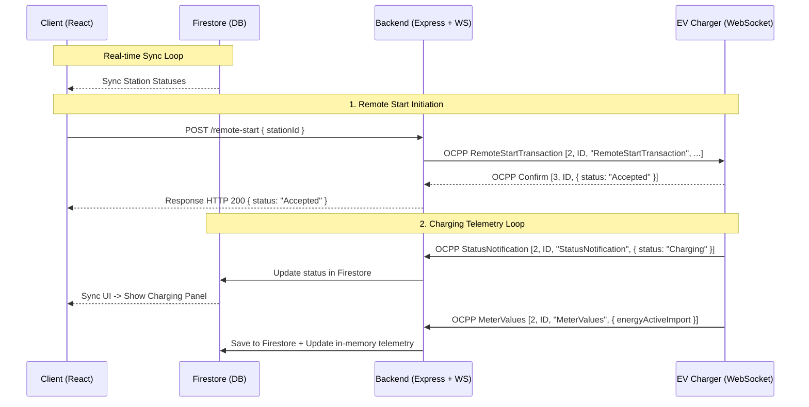

# CogniBot Web Architecture & API Mapping Documentation

This document provides a comprehensive blueprint of the web ecosystem in the `CogniBot-main` directory, detailing the architecture, every component of the frontend Client, the functions and WebSocket integrations of the OCPP Backend, and an analysis of existing API mapping gaps with concrete recommendations for alignment.

---

## 1. Directory Structure Overview (`CogniBot-main`)

```text
CogniBot-main/
├── client/                                    # Frontend React + Vite Web Application
│   ├── src/
│   │   ├── assets/                            # Static images and visual assets
│   │   ├── components/                        # Shared UI components and layout sections
│   │   │   ├── Navbar.jsx                     # Interactive responsive header
│   │   │   ├── HeroSection.jsx                # Landing hero page with modern grid and animations
│   │   │   ├── FeaturesSection.jsx            # Dynamic showcases of platform features
│   │   │   ├── HowItWorks.jsx                 # Interactive stepper explaining client flow
│   │   │   ├── AppPreview.jsx                 # Animated mockups of the EV mobile application
│   │   │   ├── DashboardSection.jsx           # Preview panel of user-facing data
│   │   │   ├── DownloadSection.jsx            # CTA section for downloading the app
│   │   │   ├── Footer.jsx                     # Branding & footer links
│   │   │   └── ProtectedRoute.jsx             # Role-based route guard (user / admin)
│   │   ├── contexts/
│   │   │   └── AuthContext.jsx                # Firebase Auth provider (Email + Google SignIn)
│   │   ├── lib/
│   │   │   ├── firebase.js                    # Web Firebase initialization
│   │   │   └── firebaseConfig.js              # Web Firebase JSON configuration
│   │   ├── pages/
│   │   │   ├── admin/
│   │   │   │   ├── AdminDashboard.jsx         # 68KB premium command dashboard for administrators
│   │   │   │   └── Admin_EVChargingFinder.jsx # Charger deployment & active network overview
│   │   │   ├── Dashboard.jsx                  # Main user telemetry & booking terminal
│   │   │   ├── EVChargingFinder.jsx           # 37KB interactive map & real-time charging station controller
│   │   │   ├── Login.jsx                      # Premium authentication access panel
│   │   │   ├── Profile.jsx                    # User identity & wallet management page
│   │   │   └── Register.jsx                   # New account registration panel
│   │   ├── services/
│   │   │   └── ocppService.js                 # Bridge service connecting Client state to OCPP Backend
│   │   ├── App.css                            # Global stylistic overrides
│   │   ├── App.jsx                            # Routing and application entry layout
│   │   ├── index.css                          # Tailwind CSS imports & base styles
│   │   └── main.jsx                           # DOM bootstrap entrypoint
│   ├── tailwind.config.js                     # Tailored styling tokens (Neo-brutalism system)
│   ├── vite.config.js                         # Build setup (Vite + React)
│   └── package.json                           # NPM dependencies
│
├── ocpp-backend/                              # OCPP 1.6 central system server
│   ├── config/
│   │   └── ocppActions.js                     # Empty placeholder config
│   ├── handlers/
│   │   └── requestHandler.js                  # Central logic processing OCPP charger calls
│   ├── services/
│   │   └── commandService.js                  # Helper functions for initiating OCPP commands
│   ├── utils/
│   │   └── sendResponse.js                    # Helper formatting OCPP CALLRESULT messages
│   ├── firebase.js                            # Firebase Admin SDK & DB bootstrap
│   ├── server.js                              # Main WS (OCPP) + HTTP (Express REST) entrypoint
│   └── package.json                           # Node.js dependencies
│
└── scriptable-ocpp-chargepoint-simulator/     # Empty/placeholder directory for local testing
```

---

## 2. Client Architecture & Components

The Client is a premium **Vite + React** single-page application heavily customized with a **Neo-brutalist / High-tech aesthetic**: bold border strokes (`border-2 border-slate-900`), stark shadows, vibrant green/blue/purple accents, and animations managed via `Framer Motion` and custom CSS.

### A. Navigation & Shell Components

*   **`Navbar.jsx`**
    *   **Description**: The application's top navigation bar. It is fully responsive and adjusts dynamically based on the current user's state.
    *   **Visual Highlights**: Subtle hover-translate animations on options, glowing state indicators.
    *   **Behavior**:
        *   If a user is logged out: Renders home navigation links and CTA buttons for **Login** and **Register**.
        *   If a user is logged in: Renders active panels depending on role. Users see "Find Charger", "Dashboard", and "Profile". Admins see the "Command Center". Displays user's name/profile and a custom styled **Logout** button.
*   **`Footer.jsx`**
    *   **Description**: High-fidelity footer summarizing the app's services, quick platform navigation links, socials, and newsletter inputs. Uses a clean dark background matching the dark slate design system.
*   **`ProtectedRoute.jsx`**
    *   **Description**: A higher-order component wrapping private routes in `App.jsx`.
    *   **Features**:
        *   Checks `currentUser` from the `AuthContext`.
        *   Redirects unauthenticated users to `/login`.
        *   Supports `adminOnly={true}`: If a standard user attempts to access `/admin`, they are redirected to `/dashboard`.
        *   Supports `blockAdmin={true}`: If an admin user attempts to access `/dashboard`, they are redirected to `/admin`.

### B. Landing Page Component Sections
When an unauthenticated user visits `/`, a dynamic compound landing page renders, composed of the following sections:

1.  **`HeroSection.jsx`**: Visually striking showcase utilizing grid line assets, a horizontal running ticker marquee, animated telemetry stats, and high-impact CTA buttons directing users to register or open the virtual finder.
2.  **`FeaturesSection.jsx`**: Highlights application capabilities (Real-time telemetry, automated OCPP syncing, route generation, instant payments) inside hover-reactive cards that translate upwards on interaction.
3.  **`HowItWorks.jsx`**: An interactive progress steps layout explaining the sequence: Register account -> Recharge virtual wallet -> Connect to live terminal -> Charge and drive.
4.  **`AppPreview.jsx`**: Visual presentation showing mockup representations of the mobile application interface to incentivize companion app usage.
5.  **`DashboardSection.jsx`**: Explains the features of the desktop telemetry client with mock charts and real-time statuses.
6.  **`DownloadSection.jsx`**: Modern banner pointing towards the Google Play and Apple App Store options with beautiful button layouts.

### C. Client Pages & User Views

*   **`Login.jsx` & `Register.jsx`**
    *   **Description**: Interactive panels incorporating Google Sign-In and traditional Email + Password authentication.
    *   **Features**: Error messaging toast notifications (`react-hot-toast`), dynamic button states with loaders, and automatic redirection to the proper workspace depending on user role (Admin -> `/admin`, User -> `/dashboard`).
*   **`Profile.jsx`**
    *   **Description**: Displays and manages user attributes.
    *   **Features**:
        *   Displays the authenticated user’s current profile photo, email address, registration timestamp, and role.
        *   **Virtual Wallet Card**: Shows `walletBalance` synced live from the user's Firestore document. Offers quick recharge buttons to increase the wallet balance directly inside the app.
        *   **Profile Editing**: Allows updating profile names and displays clear visual indicators of account sync status.
*   **`Dashboard.jsx`**
    *   **Description**: Main panel for regular users showing their active charging hub summary.
    *   **Features**:
        *   Displays metrics like active charges, total energy consumed, and cumulative expenses.
        *   Pulls historical booking entries from the Firestore `bookings` collection corresponding to `userId`.
        *   Provides quick navigational shortcuts to find chargers or edit their profile details.
*   **`EVChargingFinder.jsx` (Interactive Charging Controller)**
    *   **Description**: The central user feature of the web client. Renders an interactive map powered by **React Leaflet** and manages real-time OCPP charger control.
    *   **Core UI Sections**:
        *   **Leaflet Map Container**: Renders user geolocation marker (blue pin) alongside active chargers fetched from Firestore (green pins).
        *   **Search and Filter Bar**: Filters stations by connectivity, speed rating, and availability.
        *   **Station Detail Panel**: Shows vendor name, model, dynamic status ("Available", "Charging", "Preparing", "Offline"), slots, energy rates, and unique ID.
        *   **Active Booking Terminal**: If the user starts a session, this panel slides open to show live charging telemetry:
            *   *Time elapsed counter*.
            *   *Live Energy Imported (kWh)* calculated from real-time meter value reports.
            *   *Live bill calculation* combining starting meter values, incoming telemetry, and energy rates.
            *   *Remote Stop button* to terminate the OCPP charging sequence.

### D. Client Pages — Admin Views

*   **`AdminDashboard.jsx` (Command Center)**
    *   **Description**: An exhaustive dashboard giving admins high-level overviews of the entire charger ecosystem.
    *   **Features**:
        *   **Live Metrics Grid**: Displays aggregated network revenue, total energy supplied (kWh), active stations, and total registered users. Uses animated custom counter nodes.
        *   **Network Integrity Indicators**: Displays live latency (ms), WS uptime percentage, and telemetry diagnostics.
        *   **Identity Directory**: Displays a complete database of users, showing booking counts, payment records, live statuses, and latest charging sites. Includes searches, category filters (all / active / inactive), and list vs. grid UI layouts.
*   **`Admin_EVChargingFinder.jsx` (Deployer Portal)**
    *   **Description**: Admin map view permitting the registration of physical charging hardware.
    *   **Features**: Adds new stations directly into the Firestore database (requiring details like latitude, longitude, rate, and OCPP Station ID).

---

## 3. Backend Architecture & OCPP Server

The backend (`ocpp-backend`) is a **Node.js** central system that bridges physical/simulated EV chargers communicating via the standardized **OCPP 1.6 JSON protocol** over WebSockets, and wraps them in an **Express HTTP REST API** for standard frontend consumption.

### A. Central System Core (`server.js`)

*   **Dual Protocol Orchestration**: Serves HTTP REST endpoints alongside a `ws` WebSocket Server on a shared port.
*   **WebSocket Multiplexing**:
    *   Accepts connections at standard OCPP paths: `/ocpp/:chargePointId` or `/ws/1.6/:chargePointId`.
    *   Maintains a live directory of connected sockets: `chargers = { [chargePointId]: WebSocket }`.
    *   Tracks in-memory telemetry for connected hardware: `stationTelemetry = Map(stationId => telemetryInfo)`.
*   **In-Memory Telemetry Structure**:
    ```javascript
    {
      lastSeenAt: "ISO Date",
      lastHeartbeatAt: "ISO Date",
      lastStatusNotification: { at: "ISO Date", status: "Available|Charging|Preparing" },
      lastMeterValues: { /* raw meter value payload containing Energy.Active.Import.Register */ },
      lastRemoteStart: null,
      lastRemoteStop: null
    }
    ```

### B. OCPP Request Handling (`handlers/requestHandler.js`)

Decodes incoming OCPP messages (`[MessageTypeId (2), UniqueId, Action, Payload]`) sent from the charger, saves state to Firestore, and generates a valid OCPP `CALLRESULT` response (`[3, UniqueId, ResponsePayload]`).

*   **`BootNotification`**:
    *   Triggered when an EV charger boots up.
    *   If the station is registered in Firestore (`stations` collection), it sets `isOnline: true`, `lastSeen: Date()`, `vendor`, and `model`.
    *   Sends confirmation with `status: "Accepted"` and a `60` second heartbeat interval.
*   **`Heartbeat`**:
    *   Fires periodically to maintain the link. Updates `lastSeen` in Firestore.
    *   Returns the current system timestamp.
*   **`StatusNotification`**:
    *   Fires when the charger changes state (e.g. from `Available` to `Charging`).
    *   Updates Firestore with the specific `status`, `connectorId`, `errorCode`, and `lastSeen`.
*   **`Authorize`**:
    *   Fires when an RFID card or local tag attempts authorization.
    *   Automatically responds with `status: "Accepted"` to bypass local constraints.
*   **`StartTransaction`**:
    *   Fires when the charger starts drawing power.
    *   Generates a new incremented numeric transaction ID (`ocppTransactionId`).
    *   Adds a new document to the **`transactions`** Firestore collection with:
        `{ stationId, ocppTransactionId, connectorId, userId, meterStart, status: "active", timestamp }`.
*   **`StopTransaction`**:
    *   Fires when the charging session terminates.
    *   Queries Firestore for the corresponding active transaction ID and updates it with `meterStop`, `status: "completed"`, and `endedAt: Date()`.
*   **`MeterValues`**:
    *   Fires periodically during charging to report energy consumption metrics.
    *   Saves the raw JSON telemetry block into a **`meterValues`** collection in Firestore for auditing.

### C. Services & Utilities

*   **`services/commandService.js`**:
    *   Defines helper functions to structure OCPP payloads going out from the server to the charger (e.g. wrapping actions as `RemoteStartTransaction` and `RemoteStopTransaction`).
*   **`utils/sendResponse.js`**:
    *   Strict wrapper sending an OCPP CALLRESULT message down a WebSocket connection, verifying `ws.readyState === ws.OPEN`.

---

## 4. API & Event Mapping Analysis

This section analyzes how well the frontend client and backend talk to each other, identifying gaps where the client calls an endpoint or uses a data structure that the backend does not support, and outlines how to resolve them.

### A. Currently Mapped & Working Integrations



1.  **Station Status Synchronization**: The Client (`EVChargingFinder.jsx` / `AdminDashboard.jsx`) subscribes directly to Firestore collection snapshots (`stations`). The OCPP backend writes state changes inside `StatusNotification` and `BootNotification` handlers directly to Firestore, allowing the client UI to reflect online status or charging states in real-time.
2.  **Remote Start Command**: The Client calls `ocppSyncService.sendRemoteStart(stationId, payload)` which maps to HTTP `POST /remote-start` on the backend. The backend maps this to `RemoteStartTransaction` and transmits it via WebSockets directly to the corresponding charger.
3.  **Active Transaction Logging**: When a charger receives a remote start and triggers a physical sequence, it fires `StartTransaction` back to the backend. The backend creates a record in the Firestore `transactions` collection, which is synced on the client side.

---

### B. Identified Gaps & Missing Mappings

1.  **Missing `POST /remote-stop` HTTP Endpoint (Critical)**
    *   *Problem*: The Client `ocppService.js` defines an asynchronous function `sendRemoteStop(stationId, payload)` that issues a `POST` request to `${REMOTE_START_BASE_URL}/remote-stop` with `transactionId`. However, looking at the backend `server.js`, there is **no route** defined for `app.post("/remote-stop", ...)`. 
    *   *Impact*: When a user tries to stop their charging session from the web application UI, the HTTP call returns a `404 Not Found` error, making it impossible to stop a session through the web portal.
2.  **In-Memory Telemetry Express Expose Gap**
    *   *Problem*: In-memory telemetry (`stationTelemetry`) accumulates live `MeterValues` and `Heartbeats` on the backend. The endpoint `GET /stations/:stationId/status` returns this telemetry. However, if the server restarts, this in-memory map is completely wiped. The Client relies on this endpoint for live calculations, which can lead to calculations breaking on server restarts.
3.  **User Wallet Balances & Billing Gaps**
    *   *Problem*: The Client has a virtual wallet system (`Profile.jsx`) and calculates live billing charges (`EVChargingFinder.jsx`). However, the backend `StopTransaction` handler in `requestHandler.js` only updates the database transaction document status to `completed` and stores the final `meterStop` value. It does **not** verify user balances, calculate billing charges server-side, or deduct money from the user's wallet document in Firestore.
    *   *Impact*: Wallet balances on the client are completely decoupled from actual energy consumption, allowing users to charge infinitely without their balances decreasing.

---

### C. Blueprint to Resolve Gaps (For Future Reference)

To fully align the API and complete the web capabilities, implement the following changes:

#### Gap 1 Remedy: Implement `POST /remote-stop` in `ocpp-backend/server.js`
Create the Express API endpoint that links the client request to the WebSocket charger call:

```javascript
app.post("/remote-stop", async (req, res) => {
  const { stationId, transactionId } = req.body;

  if (!stationId || !transactionId) {
    return res.status(400).json({ error: "stationId and transactionId required" });
  }

  try {
    const payload = await sendCallAndAwaitResult(
      stationId,
      "RemoteStopTransaction",
      { transactionId: Number(transactionId) }
    );
    res.json(payload);
  } catch (error) {
    res.status(500).json({ error: error.message });
  }
});
```

#### Gap 2 Remedy: Automate Server-Side Wallet Deductions in `ocpp-backend/handlers/requestHandler.js`
In the `StopTransaction` case, load the corresponding transaction, read the starting and ending meter values, calculate total kWh consumed, multiply it by the station rate, and deduct that amount from the user's document in the `users` collection:

```javascript
// Inside StopTransaction handler:
const incomingTransactionId = Number(payload.transactionId);
if (Number.isFinite(incomingTransactionId)) {
  const txSnap = await db.collection("transactions")
    .where("ocppTransactionId", "==", incomingTransactionId)
    .where("status", "==", "active")
    .limit(1)
    .get();

  const txDoc = txSnap.docs[0];
  if (txDoc) {
    const txData = txDoc.data();
    const meterStart = Number(txData.meterStart) || 0;
    const meterStop = Number(payload.meterStop) || 0;
    const energyConsumedKwh = Math.max(0, (meterStop - meterStart) / 1000);

    // Fetch station billing rate
    const stationSnap = await db.collection("stations").doc(chargePointId).get();
    const rate = stationSnap.exists ? (Number(stationSnap.data().energyRatePerKwh) || 12) : 12;
    const totalCost = energyConsumedKwh * rate;

    // Perform database transaction to update both the transaction status and user wallet
    await db.runTransaction(async (dbTx) => {
      const userRef = db.collection("users").doc(txData.userId);
      const userSnap = await dbTx.get(userRef);

      if (userSnap.exists) {
        const currentBalance = Number(userSnap.data().walletBalance) || 0;
        const newBalance = Math.max(0, currentBalance - totalCost);
        dbTx.update(userRef, { walletBalance: newBalance });
      }

      dbTx.update(txDoc.ref, {
        meterStop,
        status: "completed",
        endedAt: new Date(),
        energykWh: energyConsumedKwh,
        amount: totalCost,
        paymentStatus: "completed"
      });
    });
  }
}
```
